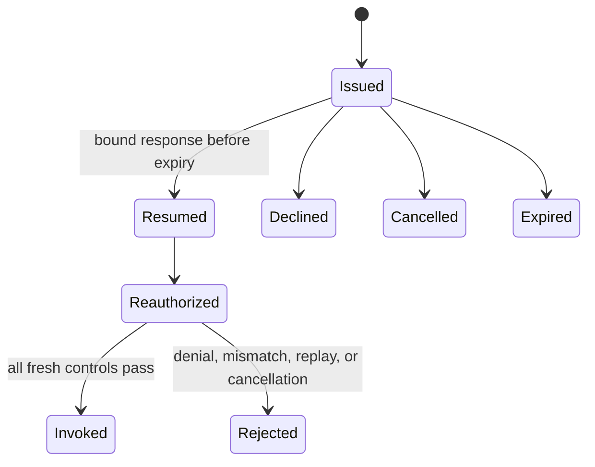

# MCP elicitation, tasks, progress, and subscriptions

> **Assembly status:** Elicitation, task, and task-snapshot subscription libraries and their MRTR/task migrations are implemented, but no first-party MCP application mounts the handlers, composes repositories, workers, an expiry runner, or a backplane, or establishes applied runtime schema state. Dedicated ordinary progress is unavailable. Profile selection does not provide persistence or process composition.

Long-running flow contracts require more than a wire method. They require canonical authorization, durable or explicitly ephemeral state, idempotency, leases, cancellation, replay reconciliation, retention, and owned worker lifecycle. Use [asynchronous processing](../../concepts/asynchronous-processing.md) for the shared model.

## Elicitation and resume

The extension `io.modelcontextprotocol/mrtr@2026-07-28` supports bounded form and URL elicitation. Request state is signed and minimally binds identity, tenant, capability, input, expiry, and replay protection. Decline and cancellation are explicit outcomes, and audit material is redacted.

Implemented bounds include:

- at most 8 requests per round;
- at most 32 fields per form;
- at most 10 rounds;
- a request-state TTL no greater than 15 minutes;
- default disabled behavior and a default 5-minute TTL when configured.

A resume is not continuation under old authority. It must re-enter the canonical invocation path and recheck authentication, active tenant, authorization, availability, confirmation, deadline, cancellation, and idempotency. Raw elicited input, identity material, and bearer credentials do not belong in audit records.

`PostgresMrtrStateRepository` uses `public.mcp_mrtr_states` and `public.mcp_mrtr_audit_events`. The checked-in migration `migrations/2026082807_create_mcp_mrtr_state.sql`, embedded by the common `MIGRATOR`, defines both tables. That establishes schema evidence, not applied runtime state or application ownership: no first-party MCP application composes the repository or its expiry and reconciliation lifecycle. Repository mutation and audit must remain atomic. An in-memory implementation is not production durability.

## Durable tasks

The official task extension implements exactly `tasks/get`, `tasks/update`, and `tasks/cancel`. It does not implement `tasks/list` or `tasks/result`. Task state models owner principal and tenant, capability revision, idempotency, budgets, input rounds, expiry, leases, fenced generations, transitions, and result state.

Worker delivery is at least once. Cancellation is cooperative, so application code must observe cancellation before committing effects; fencing prevents a stale worker generation from publishing authoritative state. Wrong-principal or wrong-tenant owner access appears as not found to preserve resource isolation.

The checked-in migration `migrations/2026082808_create_mcp_tasks.sql`, also embedded by the common `MIGRATOR`, defines `public.mcp_tasks`, idempotency and protected input-round storage including `public.mcp_task_input_rounds`, task events, and the MCP-task outbox index. A complete deployment still needs to compose the Postgres repository and payload protector, worker and outbox-relay processes, an expiry runner, a jobs provider, lease recovery, restart reconciliation, retention, and observability. No first-party MCP application supplies that ownership or proves the migration applied in a runtime.

## Task snapshot subscriptions

Subscriptions deliver bounded task snapshots. They intentionally cannot represent ordinary progress messages or task message notifications. Queues, replay pages and events, TTLs, active subscriptions, cancellation, and drain behavior are bounded. After a replay gap, a consumer must reconcile with the authoritative current task snapshot rather than assuming it received every transition.

Provider availability and guarantees differ:

| Provider capability | Profiles | Verified boundary |
|---|---|---|
| Local | `mcp-local`, `mcp-http` | Process-scoped and ephemeral; restart loses delivery state |
| Redis | `ai-platform` | Redis Pub/Sub adapter is explicitly ephemeral |
| NATS Core | `mcp-enterprise`, `full-reference-ai` | Adapter source does not establish JetStream or durable replay |

None of these rows is an exactly-once guarantee. The repository does not mount a `subscriptions/listen` handler, route, provider lifecycle, health signal, or secret/configuration schema.

## Progress is unavailable

There is no dedicated MCP progress implementation: no ordinary progress protocol, `notifications/progress` path, or task message notification handler is proven. Transport and subscription seams that mention progress do not create protocol support. Do not substitute task snapshots, progressive-discovery preview, or a proprietary method. See [MCP protocol support](../../reference/mcp-protocol-support.md).

## Deadlines, cancellation, and restart behavior

Ordinary requests remain bounded by the selected transport deadline. Long-lived subscriptions end on response, cancellation, transport EOF, or drain, but still need finite queue, replay, and TTL limits. Elicitation state expires independently. Tasks must carry an execution deadline and propagate cancellation to workers and capability implementations.

After process or provider restart:

1. reload authoritative durable task and elicitation state where a real repository is configured;
2. fence stale leases and workers;
3. reconcile outbox/inbox delivery and task snapshots;
4. treat ephemeral backplane loss as a replay gap;
5. authorize the returning principal and tenant again;
6. expire abandoned state and preserve idempotency before resuming effects.

**Expected result:** a long-running operation has one authoritative state record, owner-scoped access, finite bounds, cooperative cancellation, replay-safe transitions, and an honest provider guarantee.

**Failure path:** reject or terminate on replay, expired state, owner or tenant mismatch, failed fresh authorization, stale lease generation, invalid transition, deadline, cancellation, full queue, backplane gap, or unavailable persistence. Do not continue an effect from unverified client state.

No executable workflow is documented because the required handlers, repository/worker processes, applied migration state, and providers are not assembled. Operational ownership continues in [scaling jobs, realtime, and MCP](../../operations/scaling-jobs-realtime-and-mcp.md), and external behavior belongs in [client interoperability and conformance](client-interoperability-and-conformance.md).

## Related guidance

- [Authentication, authorization, and tenancy](authentication-authorization-and-tenancy.md)
- [Reliability and idempotency](../../concepts/reliability-and-idempotency.md)
- [Health, readiness, and shutdown](../../operations/health-readiness-and-shutdown.md)
- [MCP capability matrix](../../reference/mcp-capability-matrix.md)
