# MCP server architecture and capability exposure

`apps/mcp-server` is the checked-in MCP composition root. It independently loads configuration, connects PostgreSQL, constructs an OAuth access-token verifier from the configured issuer/resource/key material and live token-state adapter, assembles the registry/kernel/policy/tool projection, mounts authenticated `POST /mcp`, and participates in bounded process drain.

`apps/api-server` is a separate process. It owns the authorization-server and REST routes and deliberately has no MCP routes. Configuration may describe both resources, but no in-memory verifier or identity is shared between processes.

## Reference request path

```mermaid
flowchart LR
    C[External MCP client] --> H[POST /mcp]
    H --> B[OAuth bearer middleware]
    B --> X[Verified request extension]
    X --> R[Canonical context resolver]
    R --> K[MCP kernel and exposure filter]
    K --> T[RmcpToolAdapter]
    T --> G[Canonical capability registry]
    G --> S[ReferenceRecordService]
    S --> P[(PostgreSQL)]
```

The bearer middleware validates exact issuer, `/mcp` resource and audience, `reference-records:read`, signature, lifetime, revocation/live state, and global tenant policy. It inserts only `McpAuthenticatedIdentity` into request extensions. The context resolver consumes that extension to construct fresh canonical principal, policy, budget, deadline, trace, and cancellation evidence for the request; there is no session, API-key, anonymous, or local fallback.

The transport is stateless. It retains no MCP initialization, client, or session state between requests and accepts only revision `2026-07-28`.

## Exact reference capability

The reference application registers one query capability and exposes it as one tool:

| Item | Exact value |
|---|---|
| Tool name | `reference_records.list.v1` |
| Capability | `reference-records.list` version `1.0.0` |
| Permission and OAuth scope | `reference-records:read` |
| Tenant mode | global |
| Side effect | none |
| Confirmation | never |
| Implementation | `ReferenceRecordService::list` over the PostgreSQL repository and cursor paginator |

The same Axum-independent service implements the REST list behavior. MCP is an adapter over that application behavior, not a second domain layer.

Only the tools contribution is installed. Resources, prompts, elicitation, subscriptions, tasks, Apps, Skills, completion, and progress are absent from the reference capability advertisement and return method-not-found when called. Empty adapters and synthetic handlers do not satisfy a missing primitive contract.

## Deny-by-default projection and dispatch

`McpExposureFilter` checks current availability, declared MCP exposure, tenant mode, canonical authorization, and capability-specific policy before a capability is projected. Every invocation then re-enters the canonical registry, which independently enforces:

- exposure and runtime availability;
- principal authorization and tenant mode;
- confirmation policy;
- idempotency/effect identity;
- Draft 2020-12 input and output schemas;
- budgets, deadlines, and cancellation.

This invocation-time check protects against stale discovery. The reference policy additionally requires a JWT principal with no tenant and exactly the `reference-records:read` scope.

## Lifecycle

The process follows the reference application lifecycle: strict configuration, migration policy, PostgreSQL and outbound-client construction, health, OAuth verification state, MCP assembly, bind, and supervised tasks. On shutdown it begins listener and MCP drain together, rejects new MCP work, waits for admitted work within the listener deadline, and treats forced MCP drain as a forced process outcome before PostgreSQL and telemetry teardown.

## Profile boundary

The catalog profiles `mcp-http`, `mcp-enterprise`, `ai-platform`, and `full-reference-ai` select reusable module contracts. That does not make all selected primitives runnable defaults. The checked-in application proves only the tools-only `mcp-http` reference composition above. Enterprise identity, Apps, Skills, subscriptions, tasks, elicitation, additional registries, provider credentials, and product authorization policy remain application-owned and fail closed until a concrete application supplies them.

## Related guides

- [Authenticated MCP server quickstart](../../getting-started/mcp-server-quickstart.md)
- [Discovery, versioning, and transports](discovery-versioning-and-transports.md)
- [Tools, resources, and prompts](tools-resources-and-prompts.md)
- [Authentication, authorization, and tenancy](authentication-authorization-and-tenancy.md)
- [MCP capability matrix](../../reference/mcp-capability-matrix.md)
- [MCP security](../../security/mcp-security.md)
