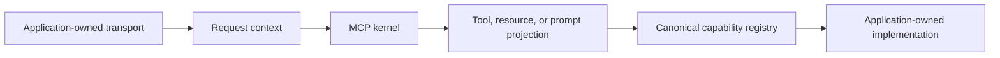

# MCP server architecture and capability exposure

> **Assembly status:** The kernel and registry projection are implemented libraries. No first-party application composes them into an MCP server, mounts `/mcp`, or starts a stdio server. The reference API intentionally leaves `/mcp` absent. Profile selection is not runtime assembly.

Omnius keeps MCP as a projection over the canonical agent capability registry. MCP does not create a second execution authority, identity model, tenant model, or approval path. For the shared concepts, see [capability and consumer contracts](../../concepts/capability-and-consumer-contracts.md) and [identity, authorization, and tenancy](../../concepts/identity-authorization-and-tenancy.md).

## Request path

The application-owned transport establishes a bounded request and supplies `McpRequestContext`: principal identity, tenant, canonical authorization facts, cancellation, and negotiated extensions. `McpKernel` is stateless across requests and does not retain MCP initialization, client, or session state.

The kernel exposes only three projection families:

- tools;
- resources;
- prompts.

Completion is unavailable. Server cards and progressive discovery are source-only previews and are not protocol capabilities. See [MCP protocol support](../../reference/mcp-protocol-support.md) for the exact support boundary.

## Deny-by-default discovery projection

When an application explicitly composes and invokes `McpExposureFilter`, a capability is eligible for its authorized projection only when all of these checks succeed:

1. its implementation is compiled and currently available;
2. its metadata declares the requested MCP exposure;
3. its tenant mode is compatible with the request tenant;
4. canonical authorization allows the operation;
5. the capability-specific authorizer allows it.

The list is deterministic after filtering. This is a standalone projection boundary, not automatic `server/discover` behavior: `StatelessHandlerAdapter::discover` does not invoke `McpExposureFilter` and returns static server information containing every configured extension. An application must disclose only preapproved extension metadata and explicitly connect filtered tool, resource, and prompt projections. A declared name, generated capability record, extension negotiation, or catalog example is not enough.

## Dispatch remains registry-owned

Every projected operation re-enters the canonical registry. The registry validates:

- exposure and current availability;
- principal authorization and tenant mode;
- confirmation or approval policy;
- idempotency and effect identity;
- Draft 2020-12 input and output schemas;
- budgets and finite deadlines;
- cancellation before and during execution.

For confirmation policy, `Never` does not require confirmation, `Policy` accepts an explicit confirmed decision or a trusted policy decision that confirmation is not required, and `Always` requires an explicit confirmed decision. Untrusted prompt text, tool arguments, resource content, an App frame, or a Skill package cannot satisfy approval.

The registry is also the final guard against stale discovery. An operation that was visible earlier must still pass fresh authorization, tenant, availability, confirmation, budget, deadline, and cancellation checks when invoked.

## Exposing a capability safely

This is a composition checklist, not a runnable repository procedure:

1. **Declare one canonical capability.** Use a stable identifier, revision, tenant mode, side-effect class, availability contract, and bounded local input/output schemas.
2. **Implement through the registry.** Do not attach business execution directly to a transport handler or MCP projection.
3. **Declare only required projections.** Choose tool, resource, or prompt exposure explicitly; absence remains the safe default.
4. **Supply authorization twice where inputs change the target.** Authorize the advertised operation before detailed validation, then reauthorize the resolved target before dispatch.
5. **Require trusted approval for effects.** Keep confirmation decisions outside client-authored or model-authored content.
6. **Bound work.** Set budgets, an absolute deadline, cancellation propagation, result-size limits, and idempotency semantics appropriate to the effect.
7. **Own state.** If the capability depends on durable state, name the repository, migration, reconciliation, retention, and worker lifecycle. A port or table name alone is not persistence proof.
8. **Compose deliberately.** Supply a first-party binary or application root, transport, authentication, secrets, tenant resolution, health/readiness, telemetry, and shutdown behavior.

**Expected result:** an assembled application exposes only preapproved server extension metadata, reveals primitive metadata only through its explicitly composed authorized projection, and reaches business code only through the registry after all controls pass.

**Failure path:** reject with bounded, redacted diagnostics when the capability is absent, unavailable, unauthorized, tenant-incompatible, unconfirmed, invalid, over budget, expired, or cancelled. Never weaken a check because discovery previously succeeded.

## Related guides

- [Discovery, versioning, and transports](discovery-versioning-and-transports.md)
- [Tools, resources, and prompts](tools-resources-and-prompts.md)
- [Authentication, authorization, and tenancy](authentication-authorization-and-tenancy.md)
- [MCP capability matrix](../../reference/mcp-capability-matrix.md)
- [MCP security](../../security/mcp-security.md)
